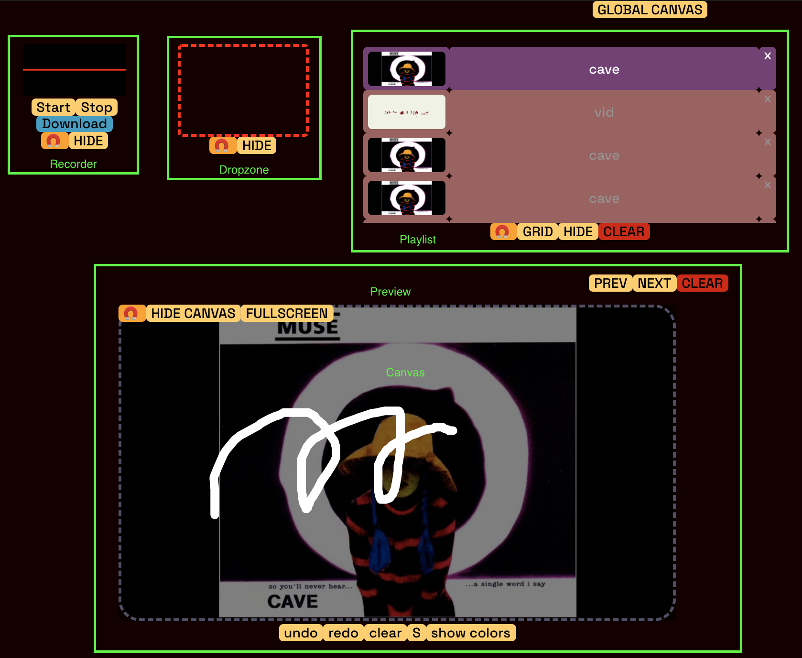
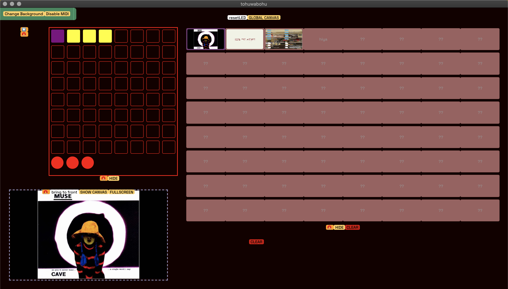

A universal media file opener / player desktop app developed in `React.js` and `Electron`.  
Uses `craco` for accessing local file system on client side.  
This project was bootstrapped with [Create React App](https://github.com/facebook/create-react-app).  
Go to [Slasher blog](https://www.slashers.blog) for more development details! 

## TODO

- Check issues

## Instruction Manual

**Supported Files:**  
Audio/Video: .mp3, .mp4  
Image: .png, .jpg, .bmmp, .gif  
Text: .txt, .md  

**Installation:**  
Install the `.dmg` file in `dist` folder.  
Double click open `backslash.app`, there should be 3 preloaded files for testing purpose. 
```diff
+ On first start, please grant the app's access to local file system.
```



**Loading files:**  
- Drag and drop any file from the computer into the `dropzone` would load that file.  
- Multiple files can be drag-drop-loaded in one operation.  
  
**Playlist operations:**  
There are two views (list/grid) for `playlist`. Grid view is friendly to image/av heavy presentations, which shows previews of the files in a grid; list view is friendly to text heavy presentations, where each file's name is clearly shown.  

- Click on a `cell` to show the file and click again to deselect. **Shift+click** multiple cells together will show multiple files.  
- If there are multiple files selected and you want to deselect one of them, **shift click** that cell.***Only click and no shift will clear the `preview`, aka. deselect all selected files.***  
- In list view, click the `X` to **delete** the file from `playlist` aka. removing it from the app's internal memo.  
- Click `CLEAR` to ***remove all loaded files from internal memo***.  
- The app would "remember" what files are added. Feel free to quit, same files will be loaded upon re-opening the app.  
- Drag the `cells` to reorder the files in the `playlist` as you wish.
- Toggle list/grid view via `LIST/GRID` button.  

**Preview operations:**  
- The shown files could be dragged with the handle🧲 and placed anywhere within the window as you like.
- Click `PREV` or `NEXT` to show prev/next file in the list/grid. This is disabled when selecting multiple files.   
- Click `CLEAR` to reset the `preview` area. This will not delete the file from the app's internal memo.  
- The color of the border indicates the order of the layer (useful when there are multiple files shown; whiter = near bottom).
- Click `FULLSCREEN` to enter fullscreen. Press `ESC` to exit fullscreen.  
- Click `BRING TO FRONT` to bring certain file to the top layer when multiple files are shown.
  
**Canvas operations:**  
`Canvas` is an overlay to image files, which allows users to jot or doodle without permanently modify the undelying image during a live presentation.  
- Click `SHOW CANVAS` on the top-left corner of one previewed image to show its own local canvas.  
- Default pencil stroke is `S` (small), click `L` on the bottom of the canvas to change pencil stroke to large.  
- Click `SHOW COLORS` to use the colorpicker.  
- Click `CLEAR` to remove all drawing history.  
- Clicking `HIDE CANVAS` or toggle fullscreen will not remove all drawing history local to the file. However, the drawings will be removed when selecting a different file from the playlist. To save the canvas, click `SAVE CANVAS`.  
- Click `GLOBAL CANVAS` to show a global overlay layer for eg. drawing the relationships between different shown files. There is no explicit saving functions for drawings on global canvas at the moment considering its use cases.  

**Editor operations:**  
Users can edit/save/download the text files from a WYSIWYG editor. The files are downloaded into the same default location as your browser downloads. They are save in `.md` to keep the styles. 

**Recorder:**  
Recorder is designed for bookkeeping and dissemination of the recorded presentation session.  
```diff 
+ For MacOS, please grant the app's access to Microphone in System Preference.  
```

**Misc:**  
- Each component is draggable to anywhere in the window with the handle🧲.  
- Preview components are resizable by dragging the sides or the corners of the displayed area. Aspect ratios are not locked. 
- To hide any of the functions that don't appear on starting the app, just click again on whatever button that made it appear. 

**Hotkeys:**  
toggle, interaction: shift  
clear: ctrl  
global: alt  

App.js:  
toggleGlobalCanvas: shift+alt+c  
toggleAudio: shift+a  
toggleZone: shift+z  
toggleList: shift+l  
clearLS: ctrl+l  
prev: left  
next: right  
clearPreview: ctrl+p  

Audio.js:  
start:  
stop:  
pause:  
download:  

Playlist.js:  
selection/deselection: shift click  

IAVMedia.js: (no button for fullscreen)  
toggleCanvas: shift+c  
enterFullscreen: shift+f  
exitFullscreen: esc  
larger: =  
smaller: -  

DrawArea.js:
undo: ctrl+z  
redo: ctrl+shift+z  
clearCanvas: ctrl+c  
toggleStroke: shift+b (bold)  
togglePicker: shift+h (hue)  

GlobalDrawArea.js:
undo: alt+ctrl+z  
redo: alt+ctrl+shift+z (lol)  
clearCanvas: alt+ctrl+c  
toggleStroke: alt+shift+b (bold)  
togglePicker: alt+shift+h (hue)  

Editor.js:  
save: ctrl+s  
download: ctrl+d  

## MIDI Ctrl Mode

Supported controller: [MidiPlus SmartPad](https://www.amazon.com/midiplus-Smartpad-USB-MIDI-Controller/dp/B00WU6FDNG)

## Folder Structure
```
.
├── build                               Assets for test will be built into this folder 
│   └── ...
├── dist    
│   ├── backslash-0.1.0-mac.zip
│   ├── backslash-0.1.0.dmg             The installer
│   ├── ...
│   └── mac
│       └── backslash.app               The exebutable
├── node_modules
│   └── {depedencies}
├── public
│   ├── asset
│   │   └── {img / av files}            The assets for test
│   ├── electron.js                     Entry point for electron-builder
│   ├── index.html
│   └── ...
├── src
│   ├── App.css
│   ├── App.js                          Main logic
│   ├── index.js                        Entry point for React app
│   ├── ...
│   └── components
│       └── ...                  
├── craco.config.js                     Enables Node.js file system on client side
├── electron-dev.js                     Entry point for electron app in dev mode
├── package.json
├── .env.electron                       Environment configuration for desktop app
├── .env.web                            Environment configuration for web app
└── ...

```

## Available Scripts

### `Installation`

To install dependencies, run: 
```
yarn
```

### `Web dev mode`

Runs the app in the development mode.<br />
Open [http://localhost:3000](http://localhost:3000) to view it in the browser.  
The page will reload if you make edits.<br />
You will also see any lint errors in the console.

```
yarn start:web
```

### `Electron dev mode`

Runs the app on desktop. Launch an electron window and reload electron automatically while developing:
```
yarn watch:electron
```
and in another console tab:
```
yarn start:electron-dev
```

### `Export`

The `build` and `dist` folders will be generated after running:

```
yarn build:electron
yarn dist
```

### `On Windows`

Please consult the `scripts` in `package.json` files in the two references.

## Other scripts

### `yarn test`

Launches the test runner in the interactive watch mode.<br />
See the section about [running tests](https://facebook.github.io/create-react-app/docs/running-tests) for more information.

### `yarn build`

Builds the app for production to the `build` folder.<br />
It correctly bundles React in production mode and optimizes the build for the best performance.

The build is minified and the filenames include the hashes.<br />
Your app is ready to be deployed!

See the section about [deployment](https://facebook.github.io/create-react-app/docs/deployment) for more information.

### `yarn eject`

**Note: this is a one-way operation. Once you `eject`, you can’t go back!**

If you aren’t satisfied with the build tool and configuration choices, you can `eject` at any time. This command will remove the single build dependency from your project.

Instead, it will copy all the configuration files and the transitive dependencies (webpack, Babel, ESLint, etc) right into your project so you have full control over them. All of the commands except `eject` will still work, but they will point to the copied scripts so you can tweak them. At this point you’re on your own.

You don’t have to ever use `eject`. The curated feature set is suitable for small and middle deployments, and you shouldn’t feel obligated to use this feature. However we understand that this tool wouldn’t be useful if you couldn’t customize it when you are ready for it.

## Learn More

You can learn more in the [Create React App documentation](https://facebook.github.io/create-react-app/docs/getting-started).

To learn React, check out the [React documentation](https://reactjs.org/).

### Code Splitting

This section has moved here: https://facebook.github.io/create-react-app/docs/code-splitting

### Analyzing the Bundle Size

This section has moved here: https://facebook.github.io/create-react-app/docs/analyzing-the-bundle-size

### Making a Progressive Web App

This section has moved here: https://facebook.github.io/create-react-app/docs/making-a-progressive-web-app

### Advanced Configuration

This section has moved here: https://facebook.github.io/create-react-app/docs/advanced-configuration

### Deployment

This section has moved here: https://facebook.github.io/create-react-app/docs/deployment

### `yarn build` fails to minify

This section has moved here: https://facebook.github.io/create-react-app/docs/troubleshooting#npm-run-build-fails-to-minify

## Slashers

- Devin Kenny
- William Leon
- Kelly Sun

## References
- [Building a production electron/create-react-app application with shared code using electron-builder](https://github.com/johndyer24/electron-cra-example/)
- [Using Create-React-App + Craco + Typescript to build apps for both the Web and Electron2](https://github.com/wwlib/cra-craco-electron-example)